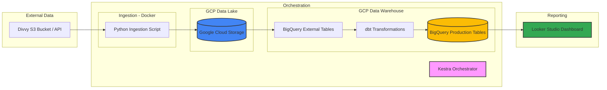

## 🚲 Chicago Divvy Data Engineering Pipeline
Data Engineering Zoomcamp 2026 Final Project
## 📌 Project Overview
This project builds an end-to-end data pipeline to analyze Chicago Divvy Bike share data. It demonstrates a modern data stack including cloud infrastructure, containerization, and automated transformations.

## Source
 I have used the source data from --https://divvy-tripdata.s3.amazonaws.com/index.html

## 🏗️ Architecture & Tools

* Infrastructure: GCP (GCS & BigQuery) managed via Terraform.
* Orchestration: Kestra running in Docker for automated ingestion and backfilling.
* Data Lake: Google Cloud Storage (Parquet format) .
* Data Warehouse: BigQuery (External & Partitioned Tables) .
* Transformations: dbt Core (models for cleaning, deduplication, and partitioning) .
* Visualization: Looker Studio (4-page interactive report) .

------------------------------
## 🚀 Quick Start (Reproducibility Guide)## 
1. Prerequisites & Environment Setup
Ensure you have the following installed on your local machine:

* Python 3.10+
* Terraform
* Google Cloud CLI 

2. GCP Project & Resource Setup (via Terraform)
Instead of manual steps, use the terraform/ folder to automatically create the GCS bucket and BigQuery dataset.

3. Pipeline Ingestion (Docker & Kestra)
Containerizing ensures the project runs identically across different OS setups .

4. The "Zoomcamp Way" is to let dbt handle partitioning and clustering.
cd dbt_divvy
dbt build  # Runs models, timestamp casts, and data quality tests

# Step 1: Authenticate with GCP
gcloud auth application-default login

# Step 2: Initialize and Apply Infrastructure
cd terraform
terraform init
terraform apply

# Step 3: Spin up the entire environment
Here is the YAML files to spin up the entire environment: 
https://github.com/annapurnachary/divvy-tripdata-pipeline/blob/main/docker-compose.yaml

Run this:
docker-compose up -d

* Go to localhost:8080 to access the Kestra UI .
* Navigate to the Backfill tab and execute for the desired date range .
Here is the Kestra Flow to run the end-to-end pipeline - divvy_master_ingestion.YAML
Link: https://github.com/annapurnachary/divvy-tripdata-pipeline/blob/main/divvy_master_ingestion.YAML 

# Step 4: Verify the data in External,Staging and Fact tables in Big Query.

After the Kestra Flow is successfully finished --
* verify the data loaded in raw layer- "divvy_data_lake"-
  where GCS buckets created Year/month wise.
* Kestra loads the data from GCS to external tables in Big query 
  "external_divvy_data"
* I used the dbt transformations for cleaning, deduplication, and partitioning the data.
* Dbt creates the staging table:
  "staging_divvy_trips" and 
  4 fact tables:
  "fct_divvy_trips"
  "fct_hourly_trends"
  "fct_station_popularity"
  "fct_popular_routes"

* Verify the data loaded in Big query Dataset called "divvy_trips_data". 

------------------------------
## 📊 Data Engineering Moments & Decisions

* Type Conversion: Converted started_at and ended_at from STRING to TIMESTAMP to allow for BigQuery partitioning .
* Partitioning: Production tables are partitioned by month to optimize query performance and cost in Looker Studio .
* Data Quality:
* Ghost Rides: Filtered out trips under 60 seconds to remove system noise .
   * Coordinate Validation: Implemented filters to ensure all Latitude/Longitude values fall within Chicago's geographic bounds .
   * Deduplication: Used row_number() to ensure each ride_id is processed only once .

------------------------------
## 📈 Dashboard Structure
The interactive report is organized into four key analytical views :

   1. Overview: Total 2023 Trips.
   2. Peak Trends: A heatmap visual showing exactly when the city is most active.
   3. Golden Routes: Analysis of network flow identifying the top 10 most popular paths.
   4. Station Rank: Busiest stations.

Based on the reports, here is a 5-point summary of the Chicago Divvy Bike dashboard:

* Significant Annual Volume: The system handled over 5.5 million trips in 2023, with peak usage occurring during the summer months (July and August).
* Member-Dominant Fleet: Subscribed members account for the majority of the ridership at 64%, while casual riders make up the remaining 36% .
* Clear Commuter Patterns: The Peak Demand Heatmap reveals heavy traffic during weekday rush hours (around 8 AM and 5 PM), specifically on days 3, 4, and 5 (Tuesday through Thursday).
* Utility vs. Recreation: While the average trip duration is approximately 18 minutes, only about 3.44% of riders utilize the service for round trips, suggesting most users use the bikes for point-to-point utility travel.
* High-Traffic Hubs: Station popularity is concentrated at major transit and tourist hubs, with Streeter Dr & Grand Ave and Clinton St & Washington Blvd ranking as the busiest starting points .

🛠️ Challenges & Lessons Learned
* Data Type Mismatches: One major challenge was the inconsistency between started_at (STRING) in raw files and the need for TIMESTAMP types for time-series analysis. This was solved by using dbt CAST functions to standardize types before materializing production tables.
* BigQuery Cost Optimization: To prevent Looker Studio from scanning the entire 5.5M+ row dataset on every refresh, I implemented Monthly Partitioning on trip start dates. This significantly reduced query costs and improved dashboard load times.
* Calculated Field Logic: Building the commute_period dimension required complex CASE statements in Looker Studio to accurately categorize "Morning" vs. "Evening" rushes, teaching me the importance of pushing logic "upstream" into dbt whenever possible.

Future Scope and improvements:
* Plannig to expand this project for the remaining years(Prior to 2020) as they have different schema than 2023,2024 etc.
* This project can be scaled up to handle 10 years worth data and compared against the official Chicago data portal:
  https://data.cityofchicago.org/stories/s/Divvy-Trips-Dashboard/u94x-unre

